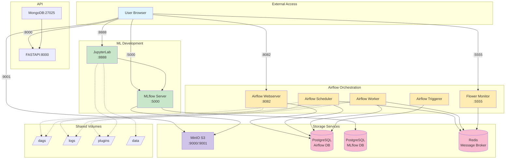

# MLOps Boilerplate : A streamlined environment for MLOps projects.

This README provides a concise guide to setting up and managing your MLOps environment, including service URLs and credentials in an easy-to-read table format.

## Architecture



## Initialization
Run the following commands to set up everything:

```sh
make init-airflow
make start
```

## Running after a first run
Run

```sh
make start
```


## Services
Here is a list of the services provided, including their URLs and credentials:

| Services          | URL                       | Credentials           |
|------------------|---------------------------|-----------------------|
| Airflow          | http://localhost:8082     | airflow/airflow       |
| JupyterLab       | http://localhost:8888     | Token: cd4ml          |
| MLflow           | http://localhost:5000     | -                     |
| MinIO S3 server  | http://localhost:9001     | mlflow_access/mlflow_secret |
| Flower (Celery)  | http://localhost:5555     | -                     |
| FastAPI          | http://localhost:8000     | -                     |

## Cleanup
To stop all running Docker containers, press `Ctrl+C` and run:

```sh
make stop
```

To delete all running Docker containers and images:

```sh
make del-containers-and-images
```


